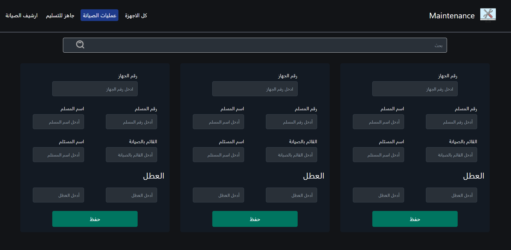

# Maintenance Management System

This Maintenance Management System allows users to manage devices, track maintenance operations, and manage the delivery of devices that are ready for customers. The system is built using React.js with React Router for client-side routing.

## Project Structure

```
Project-Maintenance/
├── public/                      # Static files
│   ├── favicon.ico
│   ├── index.html
│   ├── manifest.json
│   └── robots.txt
│
├── src/                         # Source code
│   ├── assets/                  # All static assets
│   │   ├── fonts/               # Font files
│   │   ├── icons/               # Icon files
│   │   ├── images/              # Image files
│   │   └── styles/              # Global and module CSS files
│   │
│   ├── components/              # Reusable components
│   │   ├── common/              # Common UI components (buttons, inputs, etc.)
│   │   ├── forms/               # Form components
│   │   ├── layout/              # Layout components (navbar, footer, etc.)
│   │   ├── modals/              # Modal components
│   │   └── tables/              # Table components
│   │
│   ├── config/                  # Configuration files
│   │   └── constants.js         # App constants
│   │
│   ├── data/                    # Mock data and data-related files
│   │   └── db.json              # Mock database
│   │
│   ├── features/                # Feature-specific components and logic
│   │   ├── auth/                # Authentication related components
│   │   ├── devices/             # Device management related components
│   │   └── maintenance/         # Maintenance related components
│   │
│   ├── hooks/                   # Custom React hooks
│   │
│   ├── layouts/                 # Layout components
│   │
│   ├── pages/                   # Page components
│   │
│   ├── routes/                  # Routing configuration
│   │
│   ├── services/                # API services
│   │
│   ├── store/                   # Redux store configuration
│   │   ├── slices/              # Redux slices
│   │   └── index.js             # Store configuration
│   │
│   ├── theme/                   # Theme configuration
│   │
│   ├── types/                   # TypeScript type definitions
│   │
│   ├── utils/                   # Utility functions
│   │
│   ├── validations/             # Form validation schemas
│   │
│   ├── App.jsx                  # Main App component
│   ├── index.js                 # Entry point
│   └── ThemeProvider.jsx        # Theme provider
```

## Naming Conventions

1. **Files**:

   - React components: PascalCase (e.g., `Button.jsx`)
   - Utility functions: camelCase (e.g., `formatDate.js`)
   - Constants: UPPER_SNAKE_CASE for values, PascalCase for files (e.g., `Constants.js`)
   - CSS modules: camelCase (e.g., `button.module.css`)

2. **Folders**:
   - All folders: kebab-case (e.g., `form-components/`)

## Project Overview

The project includes several key features:

- **Login Page**: User authentication and login.
- **All Devices**: Displays a list of all devices under maintenance.
- **Add Device**: Allows users to add a new device to the system.
- **Maintenance Operations**: Provides a list of devices currently under maintenance with details of operations performed.
- **Ready for Delivery**: Lists devices that are ready for delivery after maintenance.

## Pages and Screenshots

all pages in (assets/images)

### 1. Login Page

This page allows users to authenticate and log in.


### 2. All Devices

This page shows all devices under maintenance.


### 3. Add Device

On this page, users can add a new device to the system.


### 4. Maintenance Operations

This page lists all devices currently under maintenance.




### 5. Ready for Delivery

This page shows devices that are ready to be delivered.


## Technologies Used

- **Frontend**: React.js, React Router
- **Styling**: Tailwind CSS
- **State Management**: using Redux

## Installation and Setup

To get this project running locally:

1. **Clone the repository**:

   ```bash
   git clone https://github.com/mohameddnazeer/Device-Maintenance-Department
   cd Device-Maintenance-Department

   old repo https://github.com/mohameddnazeer/Project-Maintenance-
   ```
